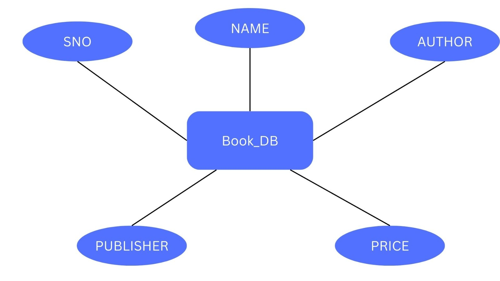

# Ex02 Django ORM Web Application
## Date: 18.03.2024

## AIM
To develop a Django application to store and retrieve data from a Book database using Object Relational Mapping(ORM).

## Entity Relationship Diagram

## DESIGN STEPS

### STEP 1:
Clone the problem from GitHub

### STEP 2:
Create a new app in Django project

### STEP 3:
Enter the code for admin.py and models.py

### STEP 4:
Execute Django admin and create details for 10 books

## PROGRAM

admin.py

from django.contrib import admin
from .models import Book,BookAdmin
admin.site.register(Book,BookAdmin)

models.py

from django.db import models
from django.contrib import admin
class Book(models.Model):
    book_id=models.IntegerField(primary_key=True)
    book_name=models.CharField(max_length=50)
    publisher_name=models.CharField(max_length=50)
    author_name=models.CharField(max_length=50)
    publisher_year=models.IntegerField()

class BookAdmin(admin.ModelAdmin):
    list_display=('book_id','book_name','publisher_name','publisher_year','author_name')

## OUTPUT

## RESULT
Thus the program for creating a database using ORM hass been executed successfully
